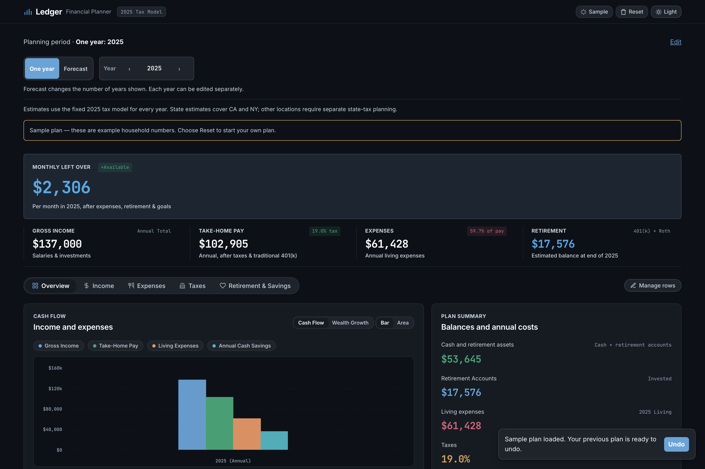
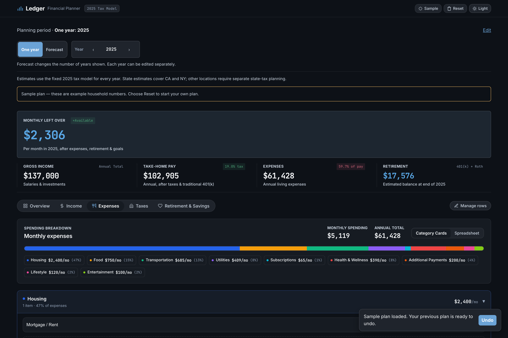
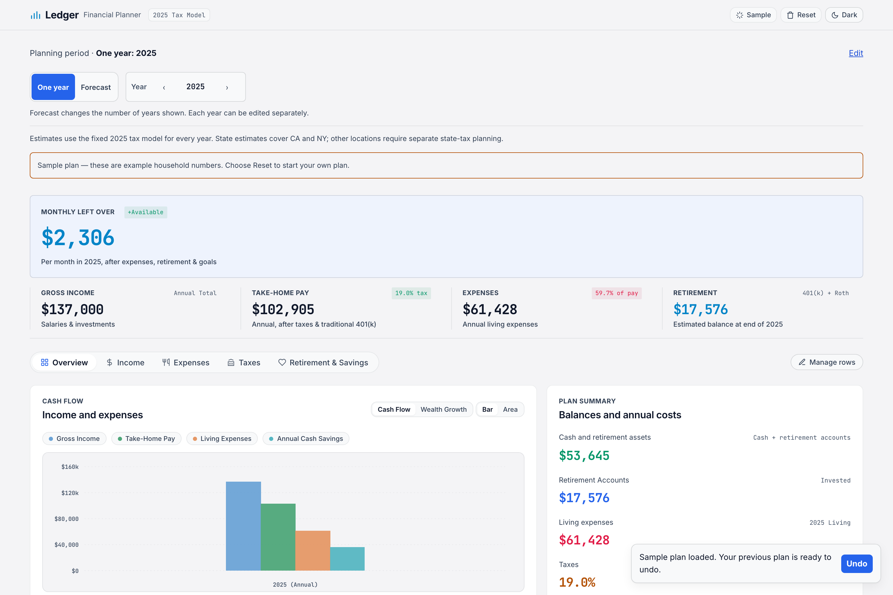

# Ledger — Household Financial Planner

A single‑page planner for a household's **income, taxes, expenses, and
retirement** — for one year or a multi‑year forecast. Enter your numbers (or
load a clearly‑labelled sample), and calculated figures — take‑home pay, effective
tax rate, monthly surplus, end‑of‑year cash and 401(k)/Roth balances — updates
live. Nothing leaves the browser.

**Live:** <https://ledger.riverakarom.com>

<p align="center">
  
</p>

---

## What it does

- **One year or a forecast.** Toggle between a single tax year and a multi‑year
  horizon; each year in the forecast is edited independently.
- **Tax estimate.** A fixed 2025 model: federal brackets, FICA (Social Security
  + Medicare), and state income tax for **CA and NY**. Traditional 401(k) is
  pre‑tax; Roth is post‑tax. The overview shows the blended effective rate.
- **Five views** of the same plan — Overview, Income, Expenses, Taxes,
  Retirement & Savings — with editable inputs. Desktop forecasts show per-year columns; phones use a
  selected-year form with Previous/Next controls.
- **Expenses** break into a fixed set of categories (Housing, Food,
  Transportation, Utilities, Subscriptions, Health & Wellness, Lifestyle,
  Entertainment, …), shown as category cards or a spreadsheet, with a
  proportional spending bar.
- **Charts.** Cash Flow (gross / take‑home / expenses / savings) and Wealth
  Growth (cash + retirement over the horizon), as bars or an area chart —
  hand‑drawn SVG, no chart library.
- **Sample plan / Reset**, with a one‑step undo. Dark and light themes.

<p align="center">
  
  
</p>

---

## How it's built

- **Zero build.** `index.html`, `js/app.js`, `js/tax_data.js`, and `css/style.css`, plain vanilla
  JavaScript — no framework, no bundler, no runtime dependencies. The only
  network request is Google Fonts (Inter, JetBrains Mono).
- **All local.** State lives in `localStorage` (`ledger_v2_planner_state`, plus
  `ledger_v2_previous_plan` for undo). No backend, no accounts, no analytics.
  There is nothing to sign into and nothing is transmitted.
- **Input handling.** Every user‑entered label is HTML‑escaped before it
  reaches the DOM; numeric inputs are coerced and `NaN`/`Infinity`‑guarded
  before they enter the tax math.
- **Deploy:** Cloudflare Workers static assets — `npx wrangler@4 deploy` from
  this folder. `.assetsignore` keeps `legacy/`, `docs/`, `LICENSE` and screenshots
  out of the bundle.

### Layout

```
Ledger/
├── index.html            markup + layout
├── js/
│   ├── app.js            planner state, rendering, SVG charts
│   └── tax_data.js       2025 tax constants
├── css/
│   └── style.css         design system (dark + light)
├── tests/browser.cjs     browser workflow and responsive-layout regression tests
├── legacy/               the original pre-split single-file version (reference)
└── wrangler.jsonc        Cloudflare static-assets deploy config
```

---

## Run it locally

```bash
cd Ledger
python3 -m http.server 8000
# open http://localhost:8000
```

No install step. Click **Sample** to populate an example household, or
**Reset** to start from a blank plan.

---

## Scope & disclaimer

The tax model is a **planning estimate**, not tax advice. It applies fixed 2025
constants to every selected year, with federal, FICA and CA/NY estimates. An
additional-deduction input and simplified child-credit phaseout are included;
this is not a complete tax-return calculation or a current-law tax service.

Retirement uses one employee 401(k) limit against combined wage income, plus
simplified Roth eligibility. It does not model each worker's plan, catch-up
contributions, debt balances, debt interest, inflation, or withdrawals. Opening
retirement balances earn the assumed return before year-end contributions.
Savings goals earmark cash; they do not create additional assets.

## Verify changes

The app needs no dependencies to run. Browser tests use a pinned development
dependency and start their own temporary local server:

```bash
npm ci
npm test
```

To run the same isolated-browser checks against a deployment:

```bash
LEDGER_URL=https://ledger.riverakarom.com/ npm test
```

Tests use disposable browser storage and do not alter an existing browser's
plan. Coverage includes typing and reload persistence, reset/undo, calculation
identities, keyboard interactions, and 110 layout combinations across five
viewport widths, both themes, and both planning modes. Phone checks use Chromium
device emulation; physical iOS/Android testing remains separate. See
[AUDIT.md](AUDIT.md) for reproduced issues and the review's limits. Test files
and dependencies are excluded from the static deployment.

## License

Proprietary — see [`LICENSE`](LICENSE). Published for portfolio review only; no
reuse, redistribution, or commercial use without written permission.

## September 2026 audit

The federal standard deduction and child credit use the final 2025 amounts,
and California brackets, deductions and personal/dependent credits use FTB's
2025 tables. Roth eligibility and child-credit phaseouts use modeled income
after traditional 401(k) contributions. References and validation are in
[AUDIT.md](AUDIT.md).

These corrections do not make the app a tax preparation system. NY high-income
recapture, preferential capital-gains/dividend rates, refundable credits,
individual retirement plans, and additional age/eligibility rules are not fully
modeled. Independent validation is required before relying on it for a return
or offering it as a comprehensive financial-advice product.
